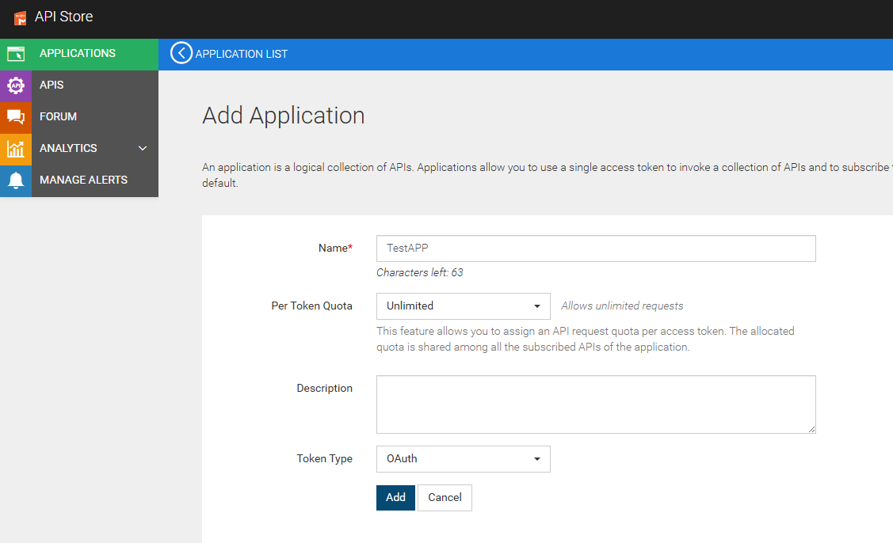
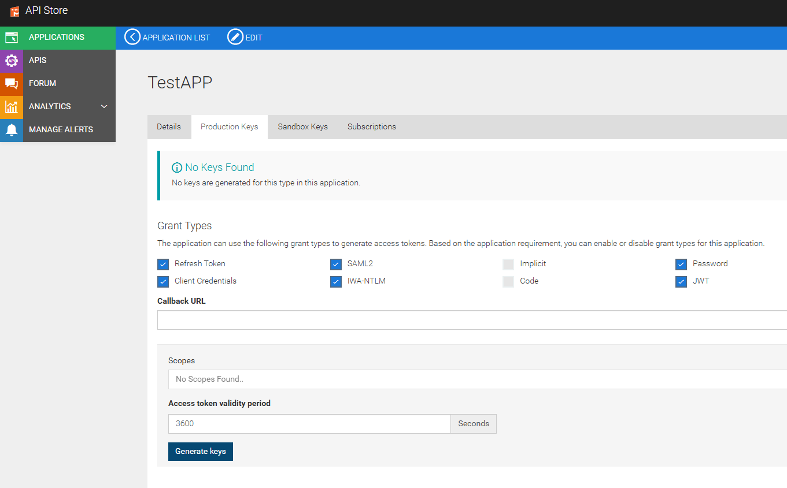
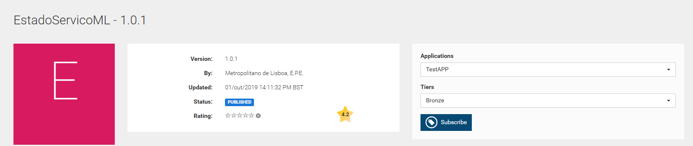
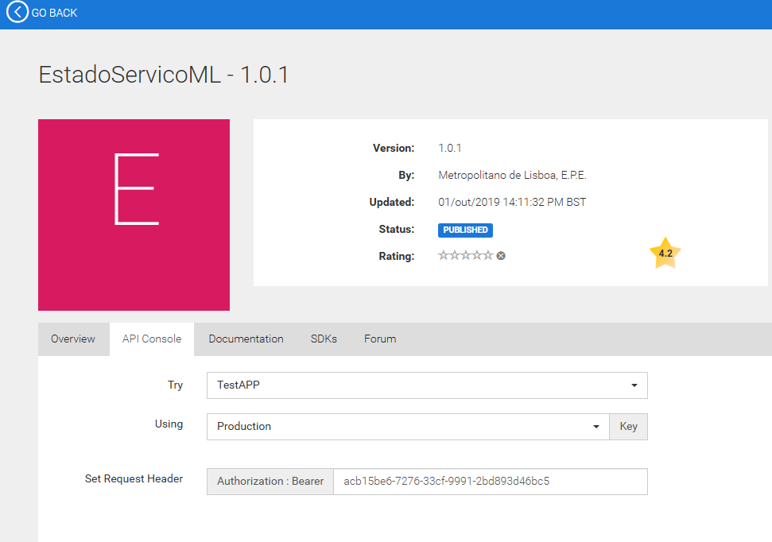

# 🚇 LisbonMetroAPI-Wrapper-MCP-Server
## 🔐 Metro Lisbon API Authentication
1. **Access the URL: https://api.metrolisboa.pt/store/**

2. **Create an Account**

3. **In the "Applications" tab, create a new application**



4. **Get Production Keys**



5. **Go to the "APIs" tab and select "EstadoServicoML - 1.0.1"**

6. **Select the application you created and subscribe to the API**



7. **Obtain the Token**



## ⚙️ Instructions to run the project via Smithery

1. **Simple prompt**
    ```
    Ex: I want to go by metro from Estádio da Luz to Altice Arena, what is the best route?
2. **More complex prompt**
    ```
    Ex: In 3 days I will visit Lisbon, staying at Vip Executive Entrecampos, and I want to visit Est